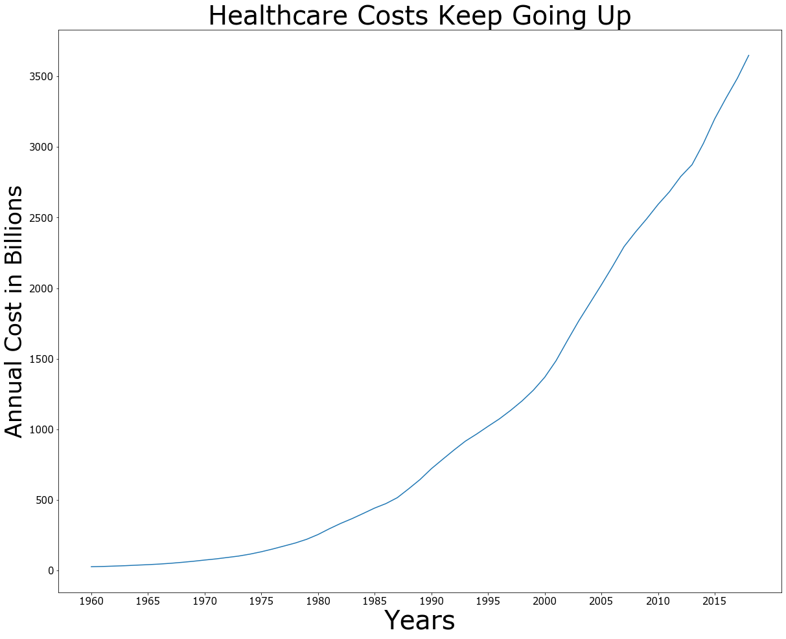
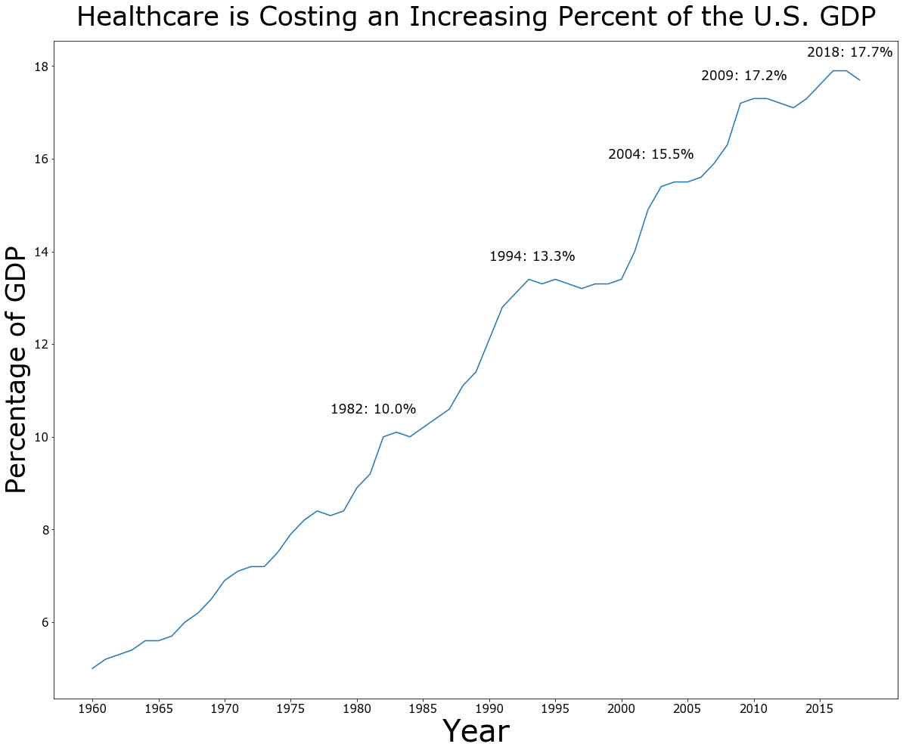
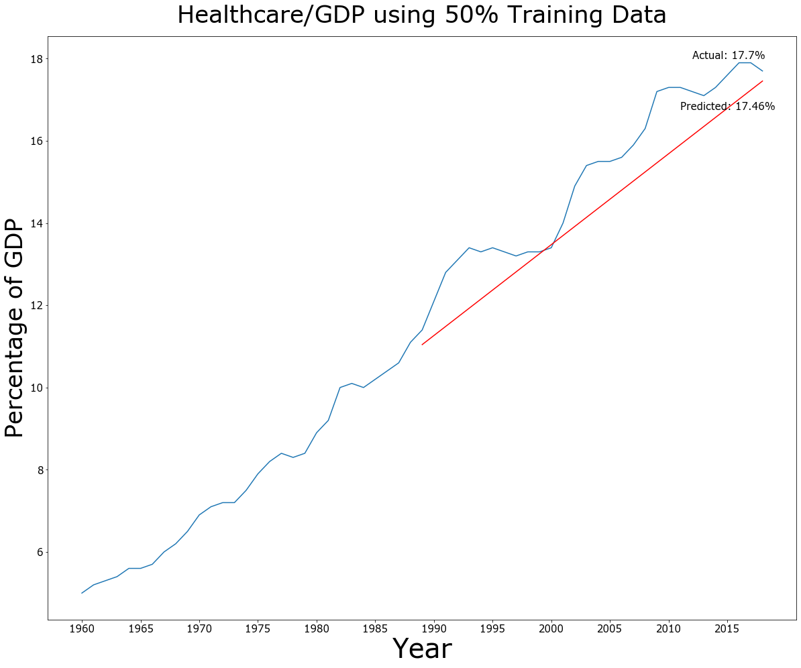
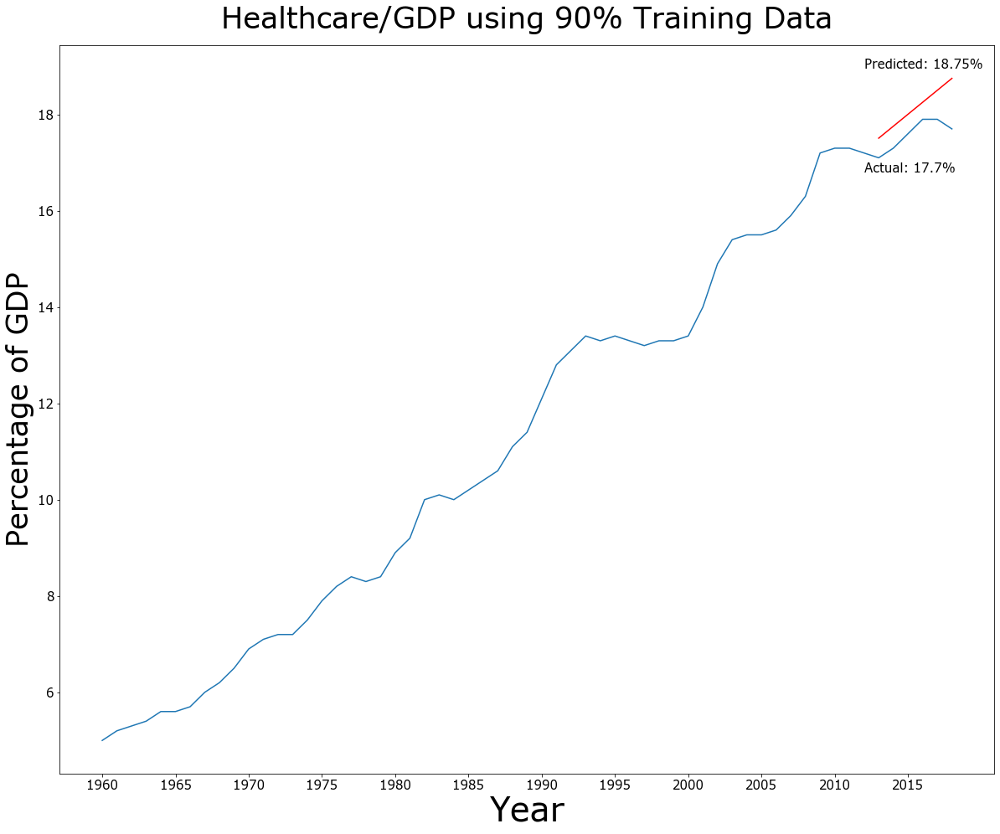
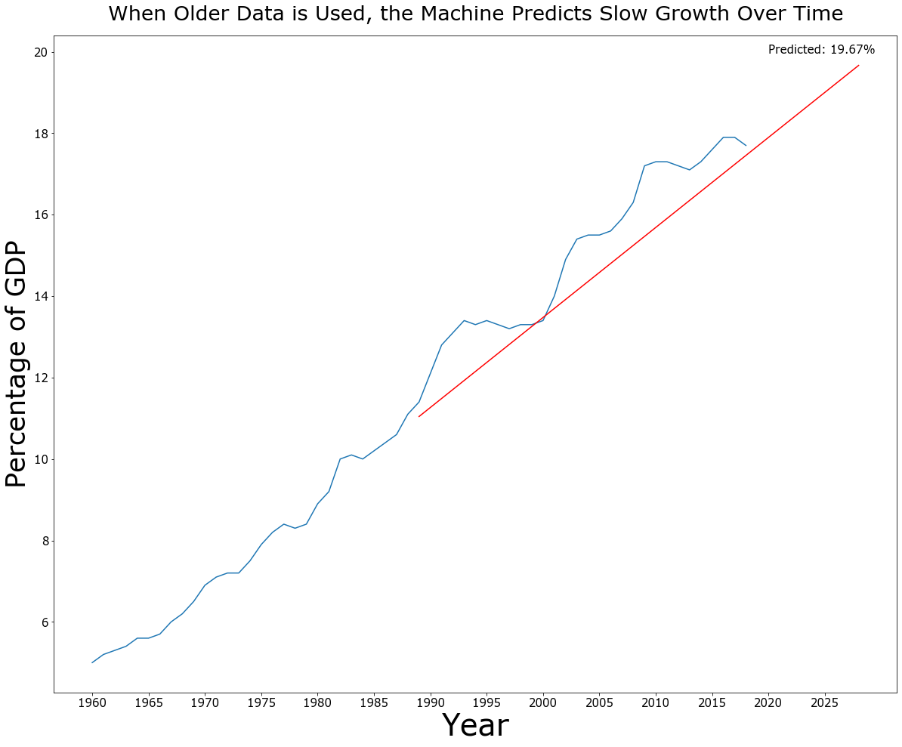
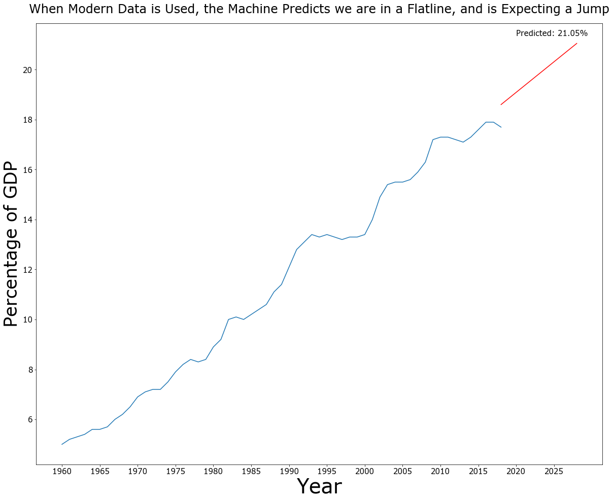
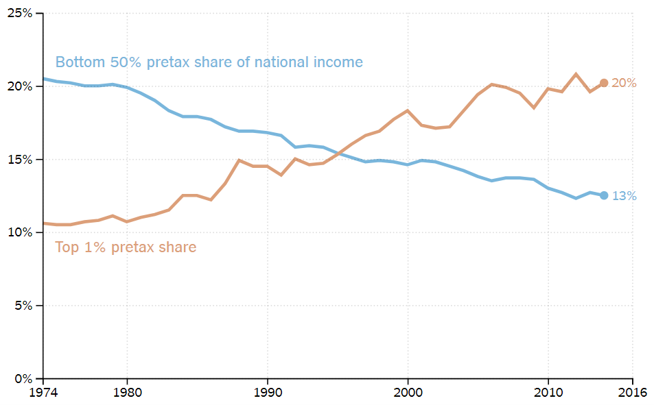

# The Increasing Cost of Healthcare in America

A while back, I was looking for some real-world data to use to enhance my skills in Supervised Machine Learning with Sklearn  and graphing with Matplotlib. At that time, politics happened to be happening, and the topic of healthcare was brought up. A lot. And so, I searched for and found The National Health Expenditure Accounts (NHEA)'s data on U.S. spending on healthcare since 1960 on [CMS.gov](https://www.cms.gov/Research-Statistics-Data-and-Systems/Statistics-Trends-and-Reports/NationalHealthExpendData/NationalHealthAccountsHistorical)

After cleaning the data to remove the commas and convert the strings to floats, I did some Exporitory Data Analysis by making some simple graphs to look at how the cost of healthcare has changed. I started with the obvious graph of the total amount of spending per year.



The first things I noticed looking at the graph is the non-linearity of the growth in spending. I would have assumed the increase would be a straight line, possibly in coordination with, if slightly above, the rate of inflation. 

So the next graph I went for was the cost as a percent of GDP, which would enable me to see how the costs increased relative to inflation.



I added the exact percent of a few years where the percent GDP seemingly flatlined, for perspective. The code used is written below.

```
plt.figure(figsize=(20,16))

plt.title("Healthcare is Costing an Increasing Percent of the U.S. GDP", fontsize=35, pad=20)

plt.plot(nhea_1960_2018.index, 
         indexed_dataset['National Health Expenditures as a Percent of Gross Domestic Product (Percent)'].astype(float))

plt.ylabel('Percentage of GDP', fontsize=35)
plt.yticks(fontsize=15)

plt.xlabel('Year', fontsize=40)
plt.xticks(
    [0, 5, 10, 15, 20, 25, 30, 35, 40, 45, 50, 55],
    [1960, 1965, 1970, 1975, 1980, 1985, 1990, 1995, 2000, 2005, 2010, 2015],
    fontsize=15)

# This changes the title of the data so that the text section doesn't get too clogged
healthcare_vs_gdp = nhea_1960_2018['National Health Expenditures as a Percent of Gross Domestic Product (Percent)'].astype(float)

# This adds the percent on the flatline years, starting the text a few years before so that they center correctly
plt.text(18, healthcare_vs_gdp[-37]+0.5, f'1982: {healthcare_vs_gdp[-37]}%', fontsize=17)
plt.text(30, healthcare_vs_gdp[-25]+0.5, f'1994: {healthcare_vs_gdp[-25]}%', fontsize=17)
plt.text(39, healthcare_vs_gdp[-15]+0.5, f'2004: {healthcare_vs_gdp[-15]}%', fontsize=17)
plt.text(46, healthcare_vs_gdp[-10]+0.5, f'2009: {healthcare_vs_gdp[-10]}%', fontsize=17)
plt.text(54, healthcare_vs_gdp[-1]+0.5, f'2018: {healthcare_vs_gdp[-1]}%', fontsize=17);
```

Unlike the costs per year, this data is relatively linear, so I decided to use this to practice Sklearns Linear Regression and Train Test Split. 


## Graphing Time

I ran the test a few times with varying sizes of the training and testing data to see which ones would overestimate and which would underestimate the percent GDP in 2018

I started by importing the necesary LinearRegression from sklearn.linear_model and train_test_split from sklearn.model_selection.

```
# I renamed the dataset to indexed_dataset after some cleaning, which you can view in the main code.
X = indexed_dataset.index.year
y_gdp = indexed_dataset['National Health Expenditures as a Percent of Gross Domestic Product (Percent)']

# Change to float now that the commas are gone.
X.astype(float)
y_gdp = y_gdp.astype(float)

# Rerun this with a different test size to see the range of predicitons
X_train, X_test, y_train, y_test = train_test_split(X, y_gdp, test_size=0.5, shuffle=False)

# Reshaping to prevent 1D Array error in next step.
X_train = X_train.values.reshape(-1, 1)
X_test = X_test.values.reshape(-1, 1)

# Instantiate the model and fit the data to it
lr_gdp = LinearRegression()
lr_gdp.fit(X_train, y_train)
```

And then I created the graphs with variations of this code.
```
# Code does need ot be changed to alter text data and it's location on the graph
plt.figure(figsize=(20,16))
plt.title("Healthcare/GDP using 50% Training Data", fontsize=35, pad=20)

plt.plot(X, y_gdp)
plt.plot(X_test, lr_gdp.predict(X_test), color='red')

plt.ylabel('Percentage of GDP', fontsize=35)
plt.yticks(fontsize=15)

plt.xlabel('Year', fontsize=40)
plt.xticks([1960, 1965, 1970, 1975, 1980, 1985, 1990, 1995, 2000, 2005, 2010, 2015],
    fontsize=15)

plt.text(2012, y_test[-1]+.3, f'Actual: {round(y_test[-1], 2)}%', fontsize=15)
plt.text(2011, lr_gdp.predict(X_test)[-1]-0.7, f'Predicted: {round(lr_gdp.predict(X_test)[-1], 2)}%', fontsize=15);
```





As you can see, using 50% of the data as training data underestimated and the 90% overestimated, as did 75% and 60%, but that's more graphs than you need to see. 

What this means is that trends since the late 80s have pointed towards a faster growth than we have seen in the last few years, and that older data pointed towards a more conservative increase. It also means that those sporadic multi-year flatlines made the data's predictions a lot wilder, and a lot less accurate.

## Prediction Time

The next step was of course to predict 10 years out (from 2018, not 2020, obviously) with the Linear Regression models we had already created. I ran this a few times with varying amounts of training data, but felt it would be biased to only show a high of a low estimator.






```
# Year and None values to enable graph to look into the future
X_test_future = np.append(X_test, [[2019], [2020], [2021], [2022], [2023], [2024], [2025], [2026], [2027], [2028]])
X_future = np.append(X, [[2019], [2020], [2021], [2022], [2023], [2024], [2025], [2026], [2027], [2028]])
y_gdp_future = np.append(y_gdp, [[None], [None], [None], [None], [None], [None], [None], [None], [None], [None]])

# Reshaping to prevent 1D Array error in next step.
X_test_future = X_test_future.reshape(-1, 1)
X_future = X_future.reshape(-1, 1)

# Again, small channges we made to the graph code to alter text and it's placement on the graph
plt.figure(figsize=(20,16))
plt.title("When Older Data is Used, the Machine Predicts Slow Growth Over Time", fontsize=27, pad=20)

plt.plot(X_future, y_gdp_future)
plt.plot(X_test_future, lr_gdp.predict(X_test_future), color='red')


plt.ylabel('Percentage of GDP', fontsize=35)
plt.yticks(fontsize=15)

plt.xlabel('Year', fontsize=40)
plt.xticks([1960, 1965, 1970, 1975, 1980, 1985, 1990, 1995, 2000, 2005, 2010, 2015, 2020, 2025],
    fontsize=15)

plt.text(2020, lr_gdp.predict(X_test_future)[-1]+0.3, f'Predicted: {round(lr_gdp.predict(X_test_future)[-1], 2)}%', fontsize=15);
```

The first graph, which is a continuation of the previous predictor using 50% of the given data as training data, has a much lower estimator for the increase by 2028. I want to make it clear that I do not believe this to be the more accurate estimator, despite is being closer to correct on the costs in 2018. The fact that is uses older data, and less data, is the reason that it greatly underestimated most of the years since the late 80s and was seemingly only correct at the end of flatline years. But I still wanted to leave this graph here as a low estimator.

The second graph, which uses 99% of the data given as training data, has a much grimmer prediction for 2028. It seems to be predicting that we are nearly the end of the current flatline. The machine predicted very similarly when the training data was 75% of the total data, 80% of the total data, and 90% of the total data.


## Ranting Time

Until this point, I have made effort to remain unbiased and to provide facts, not opinions. But I’d like to end by posting [one last graph]( https://www.nytimes.com/interactive/2016/12/16/business/economy/nine-new-findings-about-income-inequality-piketty.html), which I didn’t make myself. 



While healthcare costs have been making up an increasing amount of this nations GDP, the bottom 50% of this nation have been keeping ahold of a decreasing percent of that same GDP. 

I am not going to tell you what conclusion this information should bring you to, but I will tell you that if the conclusion you come to is bad, you should probably vote for Bernie Sanders.